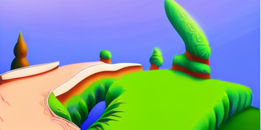

# diffusers-rs: A Diffusers API in Rust/Torch

[](https://github.com/LaurentMazare/diffusers-rs/actions)
[](https://crates.io/crates/diffusers)
[](https://docs.rs/diffusers)


_A rusty robot holding a fire torch_, generated by stable diffusion using Rust and libtorch.

The `diffusers` crate is a Rust equivalent to Huggingface's amazing
[diffusers](https://github.com/huggingface/diffusers) Python library.
It is based on the [tch crate](https://github.com/LaurentMazare/tch-rs/).
The implementation is complete enough so as to be able to run Stable Diffusion
v1.5.

In order to run the models, one has to get the weights from this [huggingface
model repo](https://huggingface.co/lmz/rust-stable-diffusion-v1-5), move them in
the `data/` directory and then can run the following command.

```bash
cargo run --example stable-diffusion --features clap -- --prompt "A rusty robot holding a fire torch."
```

The final image is named `sd_final.png` by default.
The only supported scheduler is the Denoising Diffusion Implicit Model scheduler (DDIM). The
original paper and some code can be found in the [associated repo](https://github.com/ermongroup/ddim).

## FAQ

### Memory Issues

This requires a GPU with more than 8GB of memory, as a fallback the CPU version can be used
but is slower.

```bash
cargo run --example stable-diffusion --features clap -- --prompt "A very rusty robot holding a fire torch." --cpu all
```

For a GPU with 8GB, one can use the [fp16 weights for the UNet](https://huggingface.co/runwayml/stable-diffusion-v1-5/tree/fp16/unet) and put only the UNet on the GPU.

```bash
PYTORCH_CUDA_ALLOC_CONF=garbage_collection_threshold:0.6,max_split_size_mb:128 RUST_BACKTRACE=1 CARGO_TARGET_DIR=target2 cargo run \
    --example stable-diffusion --features clap -- --cpu vae --cpu clip --unet-weights data/unet-fp16.ot
```

## Examples

A bunch of rusty robots holding some torches!


## Image to Image Pipeline

The stable diffusion model can also be used to generate an image based on
another image. The following command runs this image to image pipeline:

```bash
cargo run --example stable-diffusion-img2img --features clap -- --input-image media/in_img2img.jpg
```

The default prompt is "A fantasy landscape, trending on artstation.", but can
be changed via the `-prompt` flag.




## Inpainting Pipeline

Inpainting can be used to modify an existing image based on a prompt and modifying the part of the
initial image specified by a mask.
This requires different unet weights `unet-inpaint.ot` that could also be retrieved from this
[repo](https://huggingface.co/lmz/rust-stable-diffusion-v1-5) and should also be
placed in the `data/` directory.

The following command runs this image to image pipeline:

```bash
wget https://raw.githubusercontent.com/CompVis/latent-diffusion/main/data/inpainting_examples/overture-creations-5sI6fQgYIuo.png -O sd_input.png
wget https://raw.githubusercontent.com/CompVis/latent-diffusion/main/data/inpainting_examples/overture-creations-5sI6fQgYIuo_mask.png -O sd_mask.png
cargo run --example stable-diffusion-inpaint --input-image sd_input.png --mask-image sd_mask.png
```

The default prompt is "Face of a yellow cat, high resolution, sitting on a park bench.", but can
be changed via the `-prompt` flag.


## Converting the Original Weight Files

The weights can be retrieved as `.ot` files from
[huggingface](https://huggingface.co/lmz/rust-stable-diffusion-v1-5).
It is also possible to download the weights for the original stable diffusion
model and convert them to `.ot` files by following the instructions below.

First get the vocabulary file and uncompress it.

```bash
mkdir -p data && cd data
wget https://github.com/openai/CLIP/raw/main/clip/bpe_simple_vocab_16e6.txt.gz
gunzip bpe_simple_vocab_16e6.txt.gz
```

### Clip Encoding Weights

For the clip encoding weights, start by downloading the weight file.

```bash
wget https://huggingface.co/openai/clip-vit-large-patch14/resolve/main/pytorch_model.bin
```

Then using Python, load the weights and save them in a `.npz` file.

```python
import numpy as np
import torch
model = torch.load("./pytorch_model.bin")
np.savez("./pytorch_model.npz", **{k: v.numpy() for k, v in model.items() if "text_model" in k})
```

Finally use `tensor-tools` from the `examples` directory to convert this to a `.ot` file that tch can use.

```bash
cargo run --release --example tensor-tools cp ./data/pytorch_model.npz ./data/pytorch_model.ot
```

### VAE and Unet Weights

The weight files can be downloaded from huggingface's hub but it first requires you to log in (and to [accept the terms of use](https://huggingface.co/runwayml/stable-diffusion-v1-5) the first time). Then you can download the [VAE weights](https://huggingface.co/runwayml/stable-diffusion-v1-5/blob/main/vae/diffusion_pytorch_model.bin) and [Unet weights](https://huggingface.co/runwayml/stable-diffusion-v1-5/blob/main/unet/diffusion_pytorch_model.bin).

After downloading the files, use Python to convert them to `npz` files.

```python
import numpy as np
import torch
model = torch.load("./vae.bin")
np.savez("./vae.npz", **{k: v.numpy() for k, v in model.items()})
model = torch.load("./unet.bin")
np.savez("./unet.npz", **{k: v.numpy() for k, v in model.items()})
```

And again convert this to a `.ot` file via `tensor-tools`.

```bash
cargo run --release --example tensor-tools cp ./data/vae.npz ./data/vae.ot
cargo run --release --example tensor-tools cp ./data/unet.npz ./data/unet.ot
```
